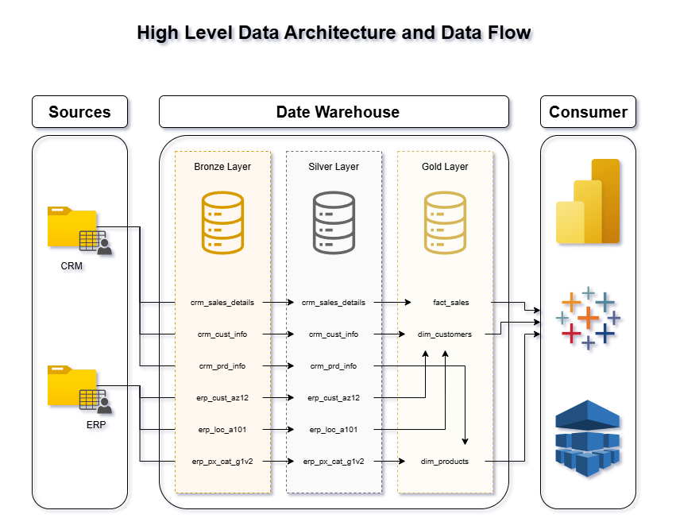
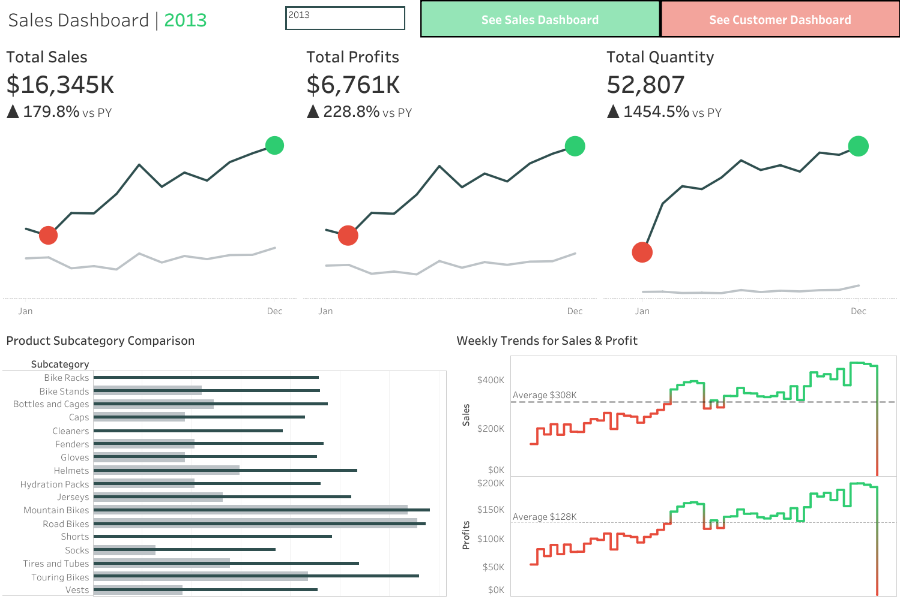
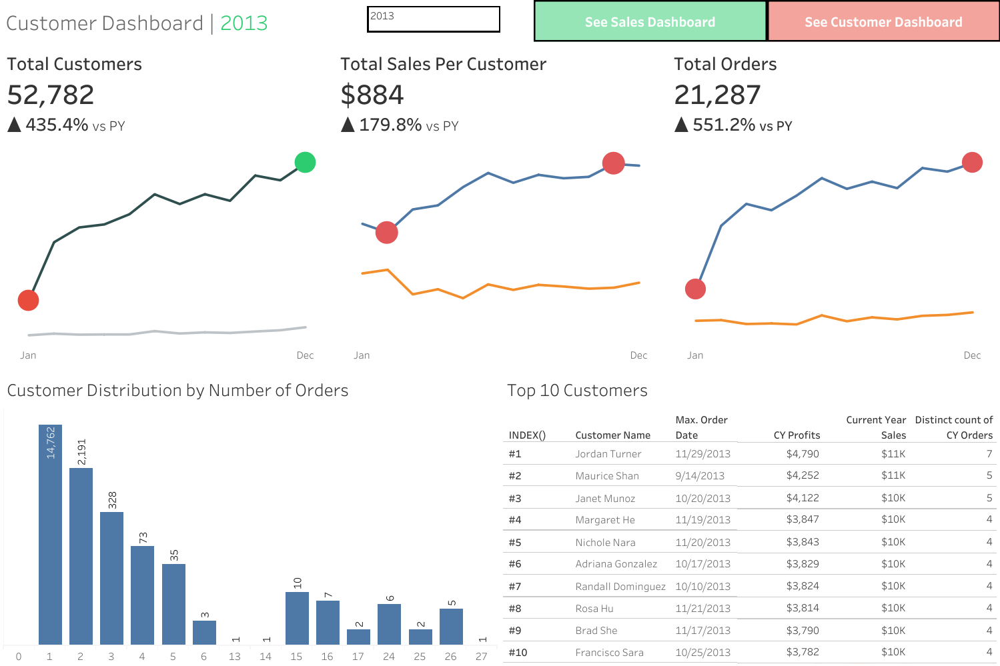

# Sales & Customer Insights Dashboard

A modern data warehousing and analytics project built using Medallion Architecture (Bronze, Silver, Gold layers) to process raw CRM and ERP data into business-ready analytical dashboards.

The project focuses on ETL workflows, data modeling, transformation pipelines, and interactive business intelligence reporting.

---

## Tech Stack

* SQL Server
* SQL
* Tableau
* ETL Pipelines
* Data Warehousing
* Medallion Architecture
* Data Modeling

---

## System Architecture

The project follows a layered Medallion Architecture approach:

* **Bronze Layer** → Raw source ingestion
* **Silver Layer** → Data cleaning and transformation
* **Gold Layer** → Analytical data modeling and reporting

<p align="center">
  
</p>

---

## Project Workflow

1. Raw CRM and ERP datasets are ingested into SQL Server.
2. ETL pipelines clean and standardize incoming data.
3. Silver-layer transformations normalize and validate datasets.
4. Gold-layer models generate fact and dimension tables.
5. Tableau dashboards visualize business and customer insights.

---

## Key Engineering Concepts

### Data Warehousing

Designed a multi-layer warehouse architecture for scalable analytical workflows.

### ETL Pipelines

Built SQL-based transformation pipelines for cleansing and preparing datasets.

### Data Modeling

Created fact and dimension tables optimized for reporting and dashboard queries.

### Business Intelligence

Developed interactive Tableau dashboards for sales and customer analytics.

---

## Dashboards

### Sales Dashboard

<p align="center">
  
</p>

* Year-over-year sales analysis
* Profit and quantity tracking
* Product subcategory comparisons
* Weekly sales and profit trends

### Customer Dashboard

<p align="center">
  
</p>

* Customer growth analytics
* Order distribution analysis
* Top customer profitability tracking
* Customer behavior insights

---

## Repository Structure

```plaintext id="t0u9dj"
datasets/
scripts/
  bronze/
  silver/
  gold/
exports/
README.md
```

---

## Future Improvements

* Automated ETL scheduling
* Cloud warehouse deployment
* Real-time dashboard updates
* Incremental data pipelines

---

## License

MIT License
